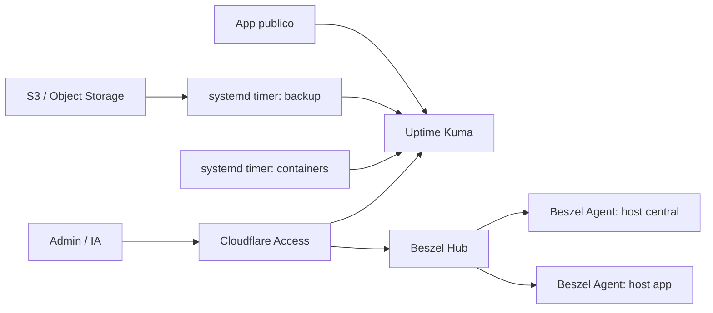

# Self-hosted Observability Stack

> Uma stack simples, publica e reproduzivel para monitorar hosts, containers,
> dominios, TLS e backups em servidores proprios.

Este repositorio documenta uma stack de observabilidade enxuta para quem roda
aplicacoes em VPSs com Docker Compose e Dokploy. A stack combina:

- Uptime Kuma para disponibilidade HTTP/TLS e heartbeats por push.
- Beszel para metricas de hosts, containers Docker e alertas de recursos.
- Beszel Agent em cada VPS, sempre preferindo rede privada.
- systemd timers para checks customizados que reportam ao Uptime Kuma.
- Cloudflare Access para proteger os paineis web.
- Tailscale como fallback quando os hosts nao compartilham rede privada.
- rclone para validar backups em S3 ou storage compativel.

O objetivo e que voce possa enviar este repo a outro operador ou agente de IA e
pedir: "instale esta stack no meu host".

## Inicio rapido

1. Leia [AGENTS.md](AGENTS.md) se voce for usar um agente de IA.
2. Preencha o inventario em [docs/templates/host-inventory.md](docs/templates/host-inventory.md).
3. Copie os exemplos de env em [examples/env](examples/env) e substitua os
   placeholders no servidor, nao no Git.
4. Siga [docs/installation.md](docs/installation.md).
5. Use [docs/operations.md](docs/operations.md) para validar e operar.

## Topologia

## Quando usar

Use esta stack quando voce quer uma base operacional leve para self-hosting,
sem montar Prometheus/Grafana/Loki logo no primeiro dia. Ela cobre perguntas
praticas:

- O site esta respondendo?
- O certificado TLS vai vencer?
- Os containers criticos estao rodando?
- CPU, memoria e disco estao perto do limite?
- O backup recente existe fora da VPS?
- Os paineis administrativos estao protegidos?

## Estrutura do repo

| Caminho | Conteudo |
| --- | --- |
| [AGENTS.md](AGENTS.md) | Instrucoes para agentes de IA instalarem a stack. |
| [docs/architecture.md](docs/architecture.md) | Como os componentes se encaixam. |
| [docs/installation.md](docs/installation.md) | Guia de instalacao ponta a ponta. |
| [docs/onboarding-targets.md](docs/onboarding-targets.md) | Como adicionar novas VPSs e apps. |
| [docs/operations.md](docs/operations.md) | Validacao, operacao e troubleshooting. |
| [docs/security.md](docs/security.md) | Modelo de seguranca e politicas de segredo. |
| [SECURITY.md](SECURITY.md) | Politica publica de reporte de vulnerabilidades. |
| [docs/references.md](docs/references.md) | Links oficiais dos apps e dependencias. |
| [docs/publishing.md](docs/publishing.md) | Como publicar esta pasta como repo publico. |
| [docs/agent-install-prompt.md](docs/agent-install-prompt.md) | Prompt pronto para enviar a outro agente de IA. |
| [examples/docker-compose](examples/docker-compose) | Composes prontos para adaptar. |
| [scripts](scripts) | Checks genericos para Uptime Kuma push. |
| [systemd](systemd) | Services e timers para os checks. |

## Stack alvo

| Camada | Padrao |
| --- | --- |
| Runtime | Docker Compose, opcionalmente gerenciado pelo Dokploy |
| Borda | Cloudflare DNS/Proxy e Cloudflare Access |
| Disponibilidade | Uptime Kuma |
| Metricas | Beszel Hub + Beszel Agent |
| Rede de agents | Private network do provedor ou Tailscale |
| Checks customizados | Bash + systemd timers |
| Backups | Qualquer destino validavel por rclone |
| Segredos | Arquivos `0600` no host ou secret manager externo |

## Principios

- Segredo nunca entra no Git.
- Painel administrativo nao fica publico sem autenticacao forte.
- Agente Beszel remoto escuta em IP privado ou VPN, nao na internet aberta.
- Se as VPSs nao estiverem na mesma rede privada ou nem forem do mesmo
  provedor, use Tailscale para criar a rede de observabilidade.
- Push monitor tem token e deve ser limitado ao minimo necessario.
- Backup so conta como OK quando existe em destino externo.
- Exemplos sao pontos de partida, nao substitutos de inventario local.

## Licenca

MIT. Veja [LICENSE](LICENSE).
