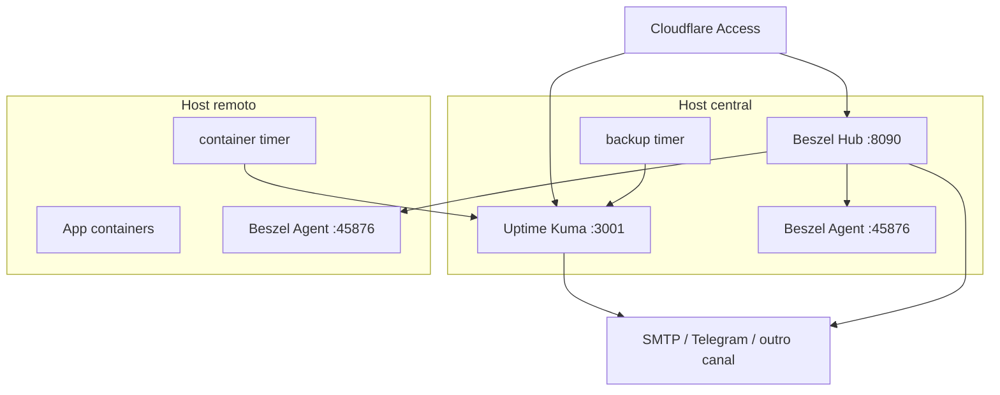

# Arquitetura

Esta stack separa observabilidade em duas responsabilidades:

- Disponibilidade e checks discretos: Uptime Kuma.
- Metricas de host/container: Beszel.

Ela nao tenta substituir uma stack completa de logs e traces. O foco e dar
visibilidade operacional rapida para hosts self-hosted.

## Componentes

| Componente | Responsabilidade | Estado persistente |
| --- | --- | --- |
| Uptime Kuma | HTTP/TLS, push heartbeat, notificacoes | SQLite em `/app/data` |
| Beszel Hub | UI, historico, alertas, usuarios | PocketBase em `/beszel_data` |
| Beszel Agent | Coleta host/container | Sem estado relevante |
| systemd timer | Executa checks customizados | Unit files no host |
| rclone | Lista backups em storage remoto | Config local ou env |
| Cloudflare Access | Autenticacao dos paineis | Cloudflare |

## Fluxo de rede

## Decisoes de desenho

| Decisao | Motivo |
| --- | --- |
| Uptime Kuma recebe push de scripts customizados | Evita expor Docker API e permite checks especificos por app. |
| Beszel usa private IP ou VPN | O agent entrega metricas sensiveis; nao deve ficar publico. |
| Timers systemd em vez de cron | Logs, status e enablement ficam padronizados via systemctl/journalctl. |
| Composes sem labels Traefik obrigatorias | Dokploy pode gerenciar dominios pela UI; outros runtimes podem adaptar. |
| Backups validados por rclone | Funciona com S3 e varios providers sem acoplar a um vendor. |

## Portas

| Porta | Origem permitida | Destino | Observacao |
| --- | --- | --- | --- |
| `3001/tcp` | Reverse proxy interno | Uptime Kuma | Nao expor direto se usar proxy. |
| `8090/tcp` | Reverse proxy interno | Beszel Hub | Nao expor direto se usar proxy. |
| `45876/tcp` | Host central/private network | Beszel Agent | Nunca abrir publicamente. |
| `587/tcp` | Hosts que enviam alerta | SMTP relay | Opcional. |

## Modelo de dados operacional

Cada app monitorado deve ter:

- FQDN publico, quando existir.
- Lista de containers criticos.
- Host onde roda.
- Backup esperado, quando houver dados persistentes.
- Monitor HTTP/TLS no Uptime Kuma.
- Push monitor de containers no Uptime Kuma.
- Push monitor de backup no Uptime Kuma, quando aplicavel.
- Sistema no Beszel.
